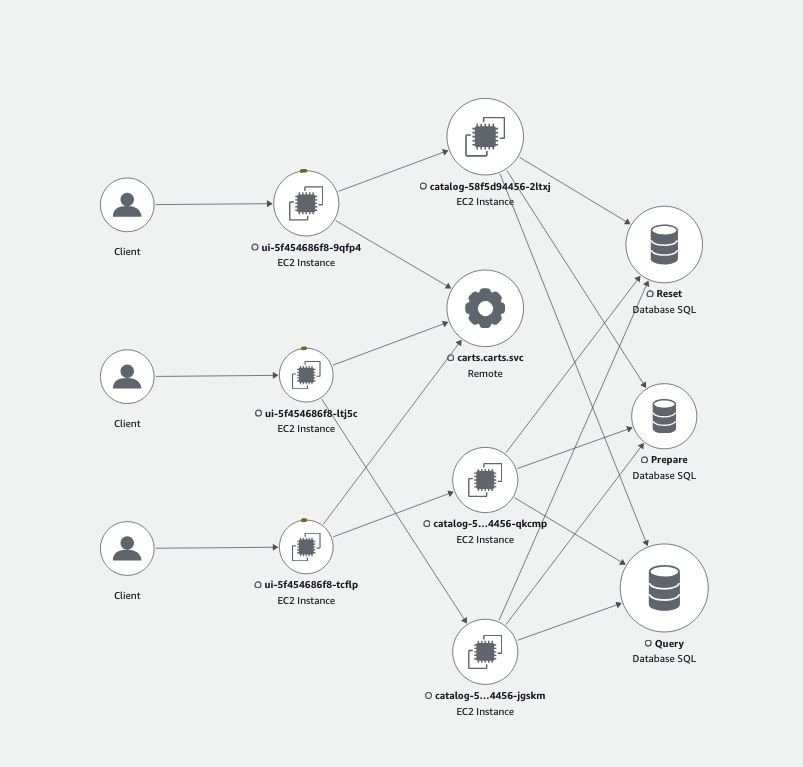

Next you’re going to configure Traffic Distribution, then re-run the load test and confirm that the traffic routing is now kept within the same AZs. 

Let’s configure Traffic Distribution on the Orders Service by running the following command: 

```bash
$ kubectl patch service orders -n orders —type='merge' -p='{"spec":{"trafficDistribution":"PreferClose"}}'
```

To confirm that Traffic Distribution is configured you run the following command: 

```bash
$ kubectl get endpointslices -l kubernetes.io/service-name=orders -n orders -o yaml
apiVersion: v1
items:
- addressType: IPv4
  apiVersion: discovery.k8s.io/v1
  endpoints:
  - addresses:
    - 10.42.185.86
    hints:
      forZones:
      - name: eu-west-1c
    nodeName: ip-10-42-181-156.eu-west-1.compute.internal
    targetRef:
      kind: Pod
      name: orders-58f5d94456-qkcmp
      namespace: orders
      uid: bd8bd6ed-8a53-493b-9595-32af90017c5a
    zone: eu-west-1c
  - addresses:
    - 10.42.150.167
    hints:
      forZones:
      - name: eu-west-1b
    nodeName: ip-10-42-141-139.eu-west-1.compute.internal
    targetRef:
      kind: Pod
      name: orders-58f5d94456-jgskm
      namespace: orders
      uid: 14bfc28f-7f7c-41c0-b9b5-39e4e73f1430
    zone: eu-west-1b
  - addresses:
    - 10.42.116.225
    hints:
      forZones:
      - name: eu-west-1a
    nodeName: ip-10-42-117-145.eu-west-1.compute.internal
    targetRef:
      kind: Pod
      name: orders-58f5d94456-2ltxj
      namespace: orders
      uid: 582c8a1b-a252-442d-9d10-22ff6c6e866d
    zone: eu-west-1a
  kind: EndpointSlice
```

You’d get a similar output to the above. If it is configured you should see hints and a corresponding AZ for the various Pods.


Next you’d run the zone-communication-analyzer script again


```bash
$ sleep 60 && zone-communication-analyzer.sh 1
```


Once this is done this time you’d notice that each Checkout pod is only sending traffic to the Orders pod in its AZ.
This demonstrates that Traffic Distribution has been configured and is working. 



