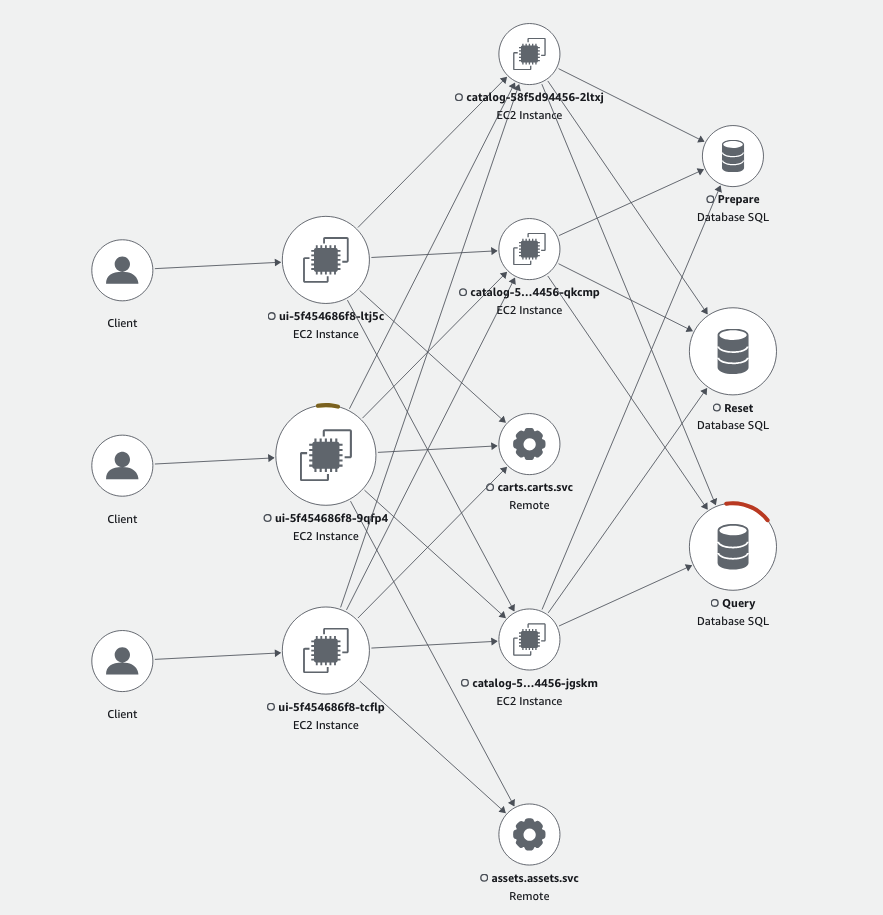

In this lab we are going to confirm the default traffic routing setup for the sample application with a focus on routing between the Checkout and Orders components through a Service.

Currently there are 3 nodes deployed across the 3 different AZs, you can confirm that with the below command: 


```bash
$ kubectl get node -ocustom-columns="Name:.metadata.name,Zone:.metadata.labels.topology\.kubernetes\.io/zone"
Name                                          Zone
ip-10-42-117-145.eu-west-1.compute.internal   eu-west-1a
ip-10-42-141-139.eu-west-1.compute.internal   eu-west-1b
ip-10-42-181-156.eu-west-1.compute.internal   eu-west-1c
```

Preparing the environment at the start will have scaled Checkout and Orders components to three replicas each. Let’s verify we see 3 pods for both components of the application with each pod running on a node in each of the 3 AZs:


```bash
$ kubectl get pods -n checkout -o wide && kubectl get pods -n orders -o wide
NAME                  READY   STATUS    RESTARTS        AGE   IP              NODE                                          NOMINATED NODE   READINESS GATES
checkout-5f454686f8-9qfp4   1/1     Running   1 (4d16h ago)   72d   10.42.124.229   ip-10-42-117-145.eu-west-1.compute.internal   <none>           <none>
checkout-5f454686f8-ltj5c   1/1     Running   1 (4d16h ago)   72d   10.42.150.160   ip-10-42-141-139.eu-west-1.compute.internal   <none>           <none>
checkout-5f454686f8-tcflp   1/1     Running   1 (4d16h ago)   72d   10.42.185.85    ip-10-42-181-156.eu-west-1.compute.internal   <none>           <none>
NAME                       READY   STATUS    RESTARTS        AGE   IP              NODE                                          NOMINATED NODE   READINESS GATES
orders-58f5d94456-2ltxj   1/1     Running   3 (4d16h ago)   72d   10.42.116.225   ip-10-42-117-145.eu-west-1.compute.internal   <none>           <none>
orders-58f5d94456-jgskm   1/1     Running   3 (4d16h ago)   72d   10.42.150.167   ip-10-42-141-139.eu-west-1.compute.internal   <none>           <none>
orders-58f5d94456-qkcmp   1/1     Running   3 (4d16h ago)   72d   10.42.185.86    ip-10-42-181-156.eu-west-1.compute.internal   <none>           <none>
```

For this lab, we use observability tools (OpenTelemetry and AWS X-Ray) as well as a 'zone-communication-analyzer' Script that analyzes and displays the traffic flow to help us visualize the behavior of Traffic Distribution.

As part of the preparation of the Lab environment which we ran previously there were different [AWS Distro for Open Telemetry(ADOT)](https://aws.amazon.com/otel/) components that got deployed in the EKS Cluster, the OpenTelemetry Collector deployed collect traces from Checkout and Orders components, exports it to AWS X-Ray and then the zone-communication-analyzer script will fetch the traces and analyze it to display traffic flow and show if it is SAME-ZONE (Checkout and Orders pod are in same zone) or CROSS-ZONE (Checkout and Orders pod are in different zone).

Let’s confirm that they are running:

[OpenTelemetry Operator](https://github.com/open-telemetry/opentelemetry-operator)

```bash
$ kubectl -n opentelemetry-operator-system get pods
NAME                                                    READY   STATUS    RESTARTS        AGE
opentelemetry-opentelemetry-operator-6c56d74b78-qkvtt   2/2     Running   2 (4d16h ago)   78d
```

The OpenTelemetry operator manages:

- [OpenTelemetry Collector](https://github.com/open-telemetry/opentelemetry-collector)
- [Auto-instrumentation](https://opentelemetry.io/docs/concepts/instrumentation/automatic/) of the workloads using OpenTelemetry instrumentation libraries

OpenTelemetry Collector

```bash
$ kubectl get opentelemetrycollector -n other
NAME   MODE         VERSION   READY   AGE   IMAGE                                                         MANAGEMENT
adot   deployment   0.104.0   1/1     72d   public.ecr.aws/aws-observability/aws-otel-collector:v0.40.0   managed
```


Now that we have 3 pods each of the Checkout and Orders component we will generate a load test using the Artillery load generator 


```bash test=false
$ cat <<EOF | kubectl apply -f -
apiVersion: v1
kind: Pod
metadata:
  name: load-generator
  namespace: other
spec:
  containers:
  - name: artillery
    image: artilleryio/artillery:2.0.0-31
    args:
    - "run"
    - "-t"
    - "http://ui.ui.svc"
    - "/scripts/scenario.yml"
    volumeMounts:
    - name: scripts
      mountPath: /scripts
  initContainers:
  - name: setup
    image: public.ecr.aws/aws-containers/retail-store-sample-utils:load-gen.1.2.1
    command:
    - bash
    args:
    - -c
    - "cp /artillery/* /scripts"
    volumeMounts:
    - name: scripts
      mountPath: "/scripts"
  volumes:
  - name: scripts
    emptyDir: {}
EOF
```


Once this is done run the zone-communication-analyzer script

```bash
$ sleep 60 && zone-communication-analyzer.sh 1
```

You’d notice from the display output that traffic from each of the Checkout pods is sent to each of the Orders pods in all 3 AZs.



